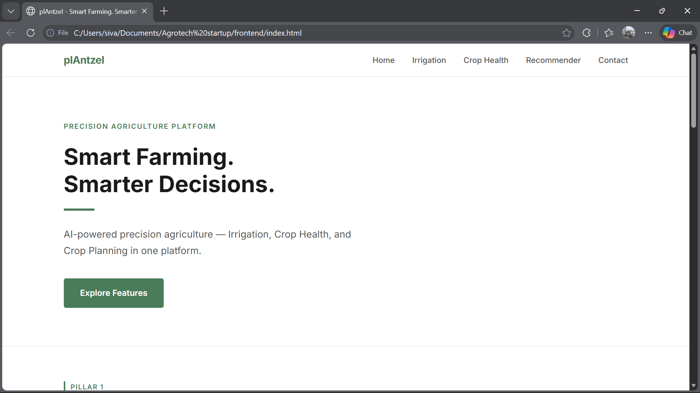
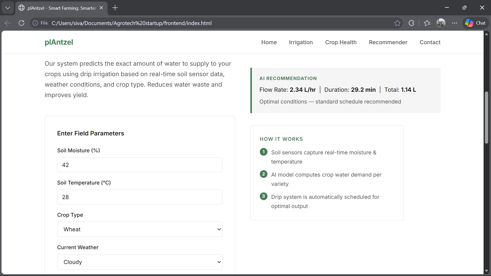
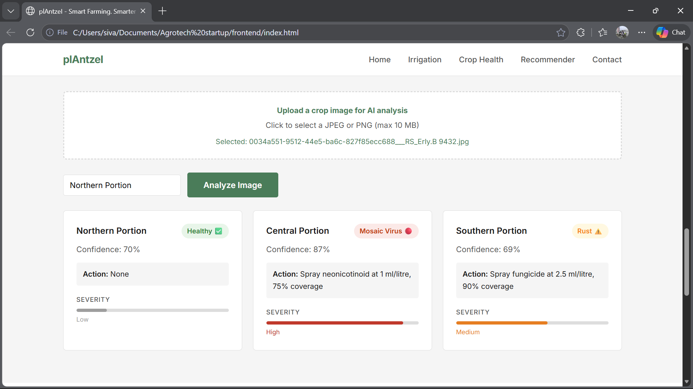
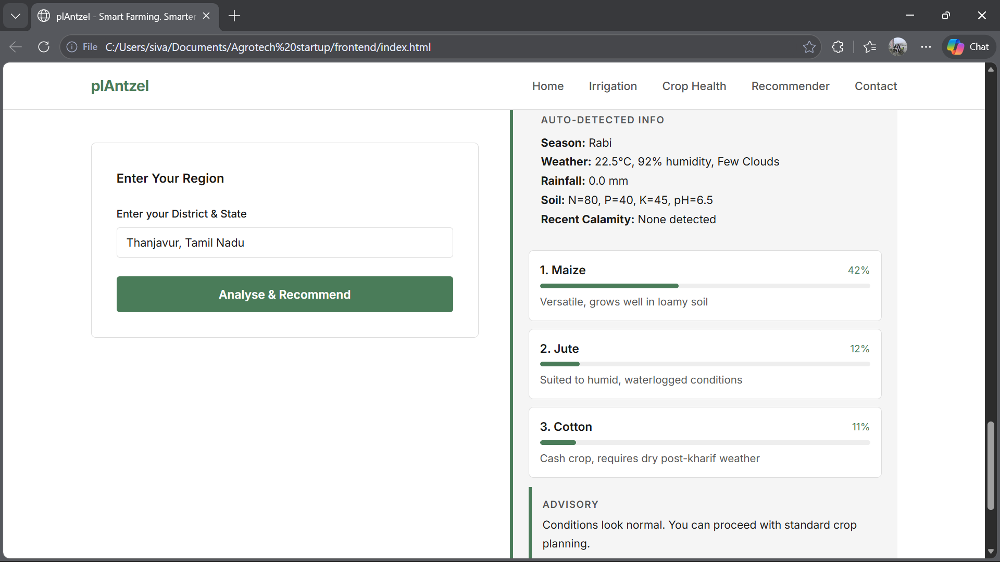

# 🌱 plAntzeI - Smart Farming. Smarter Decisions.

An AI-powered precision agriculture platform that helps farmers make data-driven decisions across three core areas: **smart irrigation**, **crop disease detection via drone**, and **intelligent crop recommendation**.

---

## 📌 Table of Contents

- [Overview](#overview)
- [Three Pillars](#three-pillars)
- [Tech Stack](#tech-stack)
- [Project Structure](#project-structure)
- [Prerequisites](#prerequisites)
- [Setup & Installation](#setup--installation)
- [API Keys Required](#api-keys-required)
- [Running the Project](#running-the-project)
- [Testing the API](#testing-the-api)
- [ML Models Used](#ml-models-used)
- [External APIs Used](#external-apis-used)
- [Dataset References](#dataset-references)
- [Contributing](#contributing)

---

## Overview

AgroSense is a full-stack agritech prototype built for a startup proposal. It combines IoT sensor data, real-time weather APIs, news intelligence, and trained ML models to provide actionable recommendations to farmers - all through a clean, minimal web interface.

---

## Three Pillars

### Pillar 1 - Smart Drip Irrigation
Predicts the exact water flow rate and duration for drip irrigation based on:
- Real-time soil moisture and temperature (from IoT sensors)
- Current weather conditions
- Crop type

**Model:** Random Forest Regressor

---

### Pillar 2 - Drone-Based Crop Disease Detection
A drone captures aerial images of crops and the AI model:
- Detects disease type (fungi, bacterial, insect damage, rust, mosaic virus)
- Determines severity (Low / Medium / High)
- Recommends pesticide type, dosage, and coverage percentage per region

**Model:** MobileNetV2 (Transfer Learning, trained on PlantVillage dataset)

---

### Pillar 3 - Crop Type Recommender
Farmer enters only their **district and state**. The system automatically:
- Fetches current weather via OpenWeatherMap API
- Detects current season from the calendar month
- Scans recent calamity news via NewsData.io API
- Looks up regional soil profile (N, P, K, pH)
- Recommends the top 3 crops to cultivate

**Model:** Random Forest Classifier

---

## Website Screenshots
 
### Hero Section

 
### Pillar 1 - Smart Drip Irrigation

 
### Pillar 2 - Drone Crop Disease Detection

 
### Pillar 3 - Crop Type Recommender


---
 
## Sample Input Images
 
> These are example crop leaf images you can use to test **Pillar 2 — Disease Detection** via the `/api/health/analyze` endpoint.
 
### Healthy Leaf

> Use this to verify the model returns `Status: Healthy` with no action required.
 
### Fungi / Blight Affected

> Expected output: `Fungi Detected`, severity Medium–High, fungicide recommendation.
 
### Insect Damage

> Expected output: `Insect Damage`, insecticide recommendation with dosage.
 
### Bacterial Spot

> Expected output: `Bacterial Spot`, bactericide recommendation.
 

## Tech Stack

| Layer | Technology |
|---|---|
| Frontend | HTML, CSS, Vanilla JavaScript |
| Backend | Python, FastAPI, Uvicorn |
| ML Models | Scikit-learn, TensorFlow/Keras |
| Real-time APIs | OpenWeatherMap, NewsData.io |
| Data Processing | NumPy, Pandas |
| Model Persistence | Joblib |
| Environment Config | python-dotenv |

---

## Project Structure

```
Agrotech startup/
├── frontend/
│   └── index.html                  # Main frontend (all-in-one HTML)
│
└── agrosense-backend/
    ├── main.py                     # FastAPI app entry point
    ├── requirements.txt            # Python dependencies
    ├── .env                        # API keys (NOT committed to git)
    ├── .env.example                # Template for environment variables
    │
    ├── routes/
    │   ├── irrigation.py           # Pillar 1 API endpoint
    │   ├── crop_health.py          # Pillar 2 API endpoint
    │   └── crop_recommend.py       # Pillar 3 API endpoint
    │
    ├── models/
    │   ├── irrigation_model.pkl    # Trained irrigation model
    │   ├── recommend_model.pkl     # Trained crop recommendation model
    │   └── disease_model.h5        # Trained disease detection model (optional)
    │
    ├── utils/
    │   ├── weather.py              # OpenWeatherMap integration
    │   ├── calamity.py             # NewsData.io integration
    │   └── image_utils.py          # Image preprocessing helper
    │
    └── training/
        ├── train_irrigation.py     # Irrigation model training script
        ├── train_disease.py        # Disease model training script
        └── train_recommend.py      # Crop recommendation training script
```

---

## Prerequisites

Make sure you have the following installed before starting:

- **Python 3.10 or above** - [Download here](https://www.python.org/downloads/)
- **Git** - [Download here](https://git-scm.com/)
- A modern browser (Chrome, Edge, Firefox)

---

## Setup & Installation

### Step 1 - Clone the repository

```bash
git clone https://github.com/Si-ra-kri/plantzei.git
cd plantzei
```

### Step 2 - Create and activate a virtual environment

**Windows (PowerShell):**
```powershell
cd backend
python -m venv venv

# If execution policy blocks activation, run this once:
Set-ExecutionPolicy -ExecutionPolicy RemoteSigned -Scope CurrentUser

.\venv\Scripts\activate
```

**Mac / Linux:**
```bash
cd backend
python3 -m venv venv
source venv/bin/activate
```

Your terminal prompt should now show `(venv)` at the start.

### Step 3 - Install all dependencies

```bash
pip install -r requirements.txt
```

---

## API Keys Required

This project uses two free external APIs. Register and get your keys before running.

| API | Purpose | Register At |
|---|---|---|
| OpenWeatherMap | Live weather + geocoding | [openweathermap.org/api](https://openweathermap.org/api) |
| NewsData.io | Recent calamity news by location | [newsdata.io](https://newsdata.io) |

### Step 4 - Create your `.env` file

Inside the `backend/` folder, create a file named `.env` (copy from the example):

**Windows:**
```powershell
copy .env.example .env
```

**Mac / Linux:**
```bash
cp .env.example .env
```

Open `.env` and fill in your actual keys:

```
OPENWEATHER_API_KEY=your_openweathermap_key_here
NEWS_API_KEY=your_newsdata_io_key_here
MODEL_DIR=./models
```

> ⚠️ **Never commit your `.env` file to GitHub.** It is already listed in `.gitignore`.

> ⚠️ **OpenWeatherMap note:** Newly created API keys take up to 15 minutes to activate. If you get a `401 Unauthorized` error, wait a few minutes and try again.

---

## Running the Project

You need **two things running simultaneously** - the backend server and the frontend file.

### Step 5 - Start the Backend

Open a terminal inside `backend/` with the virtual environment activated:

```bash
uvicorn main:app --reload --port 8000
```

You should see:
```
INFO:     Uvicorn running on http://127.0.0.1:8000
INFO:     Application startup complete.
✅ irrigation_model.pkl loaded
✅ recommend_model.pkl loaded
```

Leave this terminal running.

### Step 6 - Open the Frontend

Open a **second terminal** and run:

**Windows:**
```powershell
cd "plantzei\frontend"
start index.html
```

**Mac:**
```bash
open frontend/index.html
```

**Linux:**
```bash
xdg-open frontend/index.html
```

This opens the AgroSense website directly in your browser.

---

## Testing the API

FastAPI automatically generates an interactive API testing interface.

Once the backend is running, open this in your browser:

```
http://localhost:8000/docs
```

### Test Pillar 1 - Irrigation Prediction

Find `POST /api/irrigation/predict` → Click **Try it out** → Enter:

```json
{
  "soil_moisture": 42,
  "soil_temperature": 28,
  "crop_type": "Rice",
  "weather": "Sunny"
}
```

### Test Pillar 2 - Disease Detection

Find `POST /api/health/analyze` → Upload a crop leaf image.

### Test Pillar 3 - Crop Recommendation

Find `POST /api/recommend/crop` → Click **Try it out** → Enter:

```json
{
  "location": "Thanjavur, Tamil Nadu"
}
```

Expected response includes auto-detected season, weather summary, recent calamity (if any), and top 3 recommended crops.

### Health Check

```
http://localhost:8000/health
```

Should return: `{"status": "ok", "version": "1.0.0"}`

---

## ML Models Used

| Pillar | Model | Task Type | Dataset |
|---|---|---|---|
| Irrigation | Random Forest Regressor | Regression | Kaggle Watering Plants Dataset |
| Disease Detection | MobileNetV2 (Transfer Learning) | Image Classification | PlantVillage Dataset |
| Crop Recommendation | Random Forest Classifier | Multi-class Classification | Kaggle Crop Recommendation Dataset |

> **Note:** Pre-trained `.pkl` model files are not included in the repository due to file size. Run the training scripts in `training/` to generate them, or contact the maintainer for the model files.

---

## External APIs Used

### Real-time Data APIs

**OpenWeatherMap**
- Geocoding API - converts district/state name to coordinates
- Current Weather API - fetches live temperature, humidity, rainfall

**NewsData.io**
- Searches recent news headlines for the given district
- Detects keywords: flood, drought, cyclone, hailstorm, landslide, earthquake
- Used to determine if any recent calamity has affected the region

Together these are referred to as **Real-time Data APIs** in the system architecture.

---

## Dataset References

| Dataset | Used In | Link |
|---|---|---|
| Crop Recommendation Dataset | Pillar 3 | [Kaggle](https://www.kaggle.com/datasets/atharvaingle/crop-recommendation-dataset) |
| PlantVillage Disease Dataset | Pillar 2 | [Kaggle](https://www.kaggle.com/datasets/abdallahalidev/plantvillage-dataset) |
| Watering Plants Dataset | Pillar 1 | [Kaggle](https://www.kaggle.com/datasets/nelakurthisudheer/dataset-for-predicting-watering-the-plants) |

---

## Common Errors & Fixes

| Error | Cause | Fix |
|---|---|---|
| `401 Unauthorized` from OpenWeatherMap | Key not yet active or wrong key | Wait 15 mins after registration; verify key in `.env` |
| `Could not fetch data for this location` | Backend not running or `.env` missing | Start uvicorn and verify `.env` exists |
| `Import could not be resolved` in Cursor | Wrong Python interpreter selected | Ctrl+Shift+P → Python: Select Interpreter → pick venv |
| `running scripts is disabled` in PowerShell | Execution policy blocked | Run `Set-ExecutionPolicy RemoteSigned -Scope CurrentUser` |
| `502 Bad Gateway` | API key placeholder still in `.env` | Open `.env` and replace placeholder text with real key |

---

## Contributing

1. Fork the repository
2. Create a feature branch: `git checkout -b feature/your-feature`
3. Commit your changes: `git commit -m "Add your feature"`
4. Push to the branch: `git push origin feature/your-feature`
5. Open a Pull Request

---

*Built as a startup prototype for AI-powered precision agriculture.*
